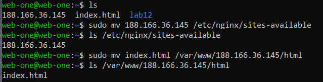

# ACIT 2420 Week 12 Lab 

## Team member(s)
ByeongJu(Jace) Kang  
Dennis Phan

## Setting up NGINX on a server
This is a guide on how to install NGINX on a server with a firewall

### Step 1

Install NGINX on the server by following these instructions:

1. Run the command `sudo apt upgrade`

    

2. Run the command `sudo apt install nginx`
 
 
    

3. Run the command `sudo systemctl status nginx`

    

### Step 2

Move your files locally to the server with the sftp

1. Run `sftp -i ~/.ssh/your_key your_user@your_ip`

    

### Step 3

Use the HTML document in the repository and place it into `/var/www/your_ip/html/`  
Place the NGINX server block file in `/etc/nginx/sites-available/` to serve the HTML.

1. Move your files to

    

2. Creating a soft link to new server block in sites-enabled `sudo ln -s /etc/nginx/sites-available/your_ip /etc/nginx/sites-enabled/`
   Where `your_ip` is the ip of your server
3. Verify it works with `sudo nginx -t`  

    

### Step 4

1. Run the command `sudo systemctl daemon-reload`
2. Run the command `sudo systemctl reload nginx.service`

### Step 5

1. Visit your server's ip and the html should be rendered like below:

### Step 6

1. Check the status of ufw by running `sudo ufw status`
2. Check the available applications by running `sudo ufw app list`
3. Run `sudo ufw allow application` for the list of available application from the previous command and replace the application name where `application` is
4. Run `sudo ufw allow <blank>` and replace <blank> with `80`, `ssh` `http` and enter the command three times respectively
5. Run the command `sudo ufw enable`
7. Press `y` and press `Enter`
8. Check the status for ufw by running `sudo ufw status numbered` 

      
    
    

### Step 7

1. Check your ip address if it still renders after the firewall is installed by visiting your ip address
    
     
    
2. Check if you are able to ssh into your server after the firewall is installed
    
    
